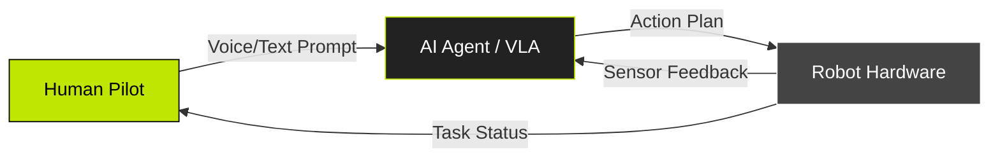
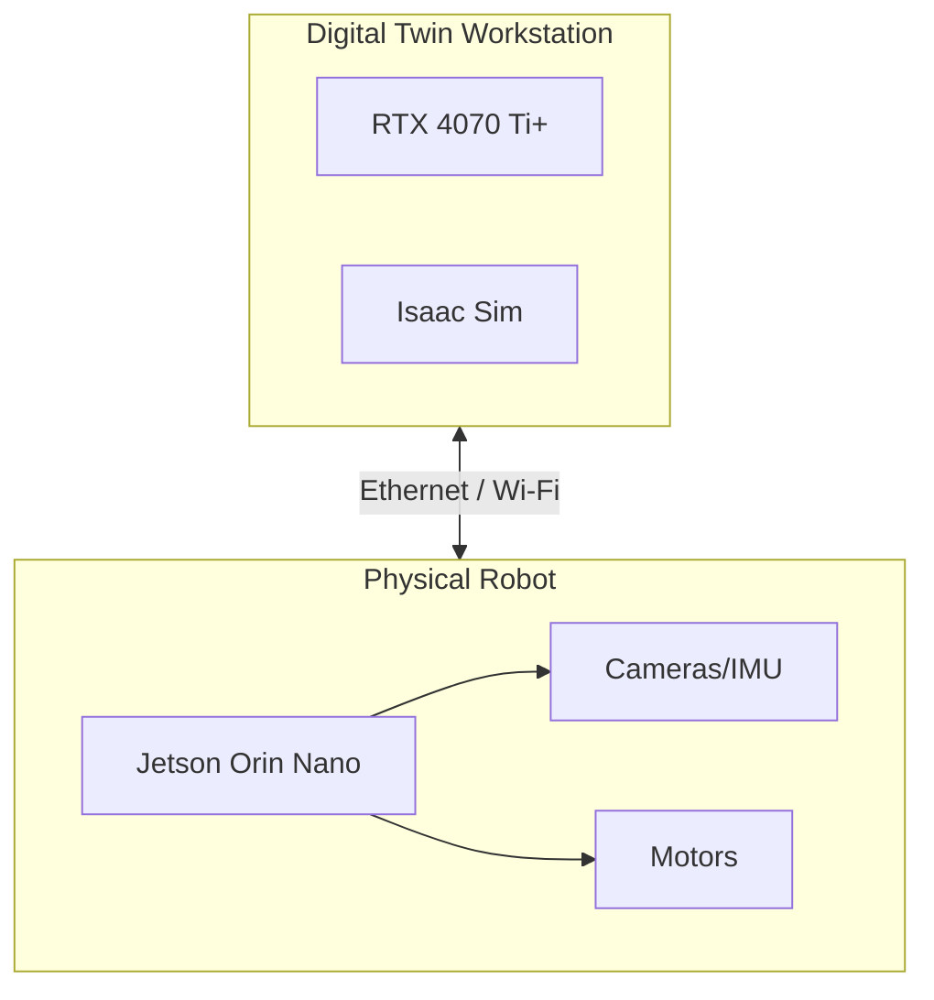

import HardwareCheck from '@site/src/components/HardwareCheck';
import TermTooltip from '@site/src/components/TermTooltip';

# Chapter 1: The Age of Embodied Intelligence

## 1.1 The Great Transition

We are standing at the precipice of a technological shift as profound as the internet itself. For the past decade, Artificial Intelligence has largely been a "brain in a jar"—powerful models like GPT-4 processing text and images in the cloud, disconnected from the physical world. This is the era of **Generative AI**.

But intelligence is not just about thinking; it is about *acting*.

The next frontier is **Physical AI**: intelligence that can perceive the physical world, reason about physics and causality, and execute complex tasks through robotic bodies. This transition marks the end of the "digital-only" era and the beginning of the **Age of Embodied Intelligence**.

### Moravec's Paradox
Why did we solve calculus and chess before we could teach a robot to fold a shirt? This is known as **Moravec's Paradox**:

> *High-level reasoning requires very little computation, but low-level sensorimotor skills require enormous computational resources.* [1]

For a human, walking is effortless and chess is hard. For a machine, chess is trivial, but walking across a cluttered room involves solving thousands of differential equations per second. This paradox has stalled robotics for decades. However, recent breakthroughs in **End-to-End Learning** and **Vision-Language-Action (VLA)** models are finally breaking this barrier.

## 1.2 The Triad Architecture

To build Physical AI, we cannot rely on a single "black box" model. We need a structured system that combines human intent, high-level reasoning, and low-level control. We call this the **Triad Architecture**.

This architecture defines the **"Partnership of People + AI + Robots"**:

1.  **Human (The Pilot)**: Provides the high-level intent or goal (e.g., "Clean the kitchen").
2.  **AI Agent (The Planner)**: Deconstructs this goal into a sequence of logical steps (e.g., "Pick up cup", "Move to sink").
3.  **Robot (The Executor)**: Translates these steps into motor commands (torque, velocity) to physically move the hardware.

In this course, you will build each layer of this triad, starting from the bottom (Hardware) up to the top (AI Agent).

## 1.3 The Hardware Nervous System

Building Embodied Intelligence requires a specific class of hardware. You cannot train these models on a standard laptop. We treat the hardware as a **Nervous System**—a specialized network for processing sensory data and motor signals.

:::warning Critical Requirement
This course relies on **NVIDIA Isaac Sim**, which requires RTX-class GPUs with Ray Tracing capabilities.
:::

Use the interactive validator below to check if your current setup is ready for the course.

<HardwareCheck />

### Hardware Topology
The standard development setup involves two distinct computers working in tandem:

1.  **The Workstation (The Brain)**: A powerful PC running Ubuntu 22.04. This machine runs the "Digital Twin" simulations (Isaac Sim) and trains the AI models. It requires massive parallel processing power (CUDA).
2.  **The Edge Computer (The Spine)**: A small, power-efficient computer attached to the robot itself (e.g., NVIDIA Jetson). It handles real-time sensor processing and motor control during deployment.

## 1.4 Senses of the Machine

For a robot to act, it must first perceive. In <TermTooltip term="ROS 2">ROS 2</TermTooltip>, we refer to this as the perception stack.

### Vision (RGB-D)
Cameras are the primary sensor for modern robotics. We use **RGB-D** cameras (Red, Green, Blue + Depth). Unlike a standard webcam, an RGB-D camera (like the Intel RealSense) projects a pattern of infrared light to calculate the distance to every pixel, creating a 3D "Point Cloud" of the world. This allows the robot to understand geometry, not just color.

### Balance (IMU)
The **Inertial Measurement Unit (IMU)** is the robot's inner ear. It measures acceleration and rotational velocity using micro-electromechanical systems (MEMS). This data is critical for <TermTooltip term="SLAM">SLAM</TermTooltip> algorithms to track the robot's movement even when the cameras are blocked.

### Proprioception (Encoders)
Just as you know where your hand is without looking at it, a robot uses **Motor Encoders** to measure the exact angle of every joint. This internal feedback loop allows for precise motion control.

## References

[1] H. Moravec, *Mind Children: The Future of Robot and Human Intelligence*. Harvard University Press, 1988.
[2] S. Levine et al., "End-to-End Training of Deep Visuomotor Policies," *Journal of Machine Learning Research*, vol. 17, no. 39, pp. 1-40, 2016.
