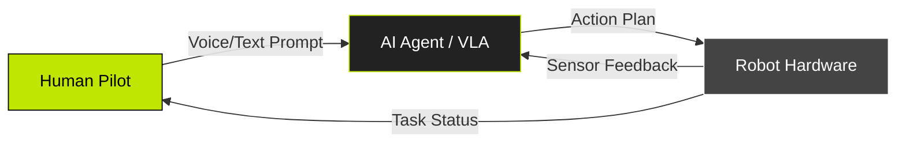

## 1.2 The Triad Architecture

To build Physical AI, we cannot rely on a single "black box" model. We need a structured system that combines human intent, high-level reasoning, and low-level control. We call this the **Triad Architecture**.

This architecture defines the **"Partnership of People + AI + Robots"**:

1.  **Human (The Pilot)**: Provides the high-level intent or goal (e.g., "Clean the kitchen").
2.  **AI Agent (The Planner)**: Deconstructs this goal into a sequence of logical steps (e.g., "Pick up cup", "Move to sink").
3.  **Robot (The Executor)**: Translates these steps into motor commands (torque, velocity) to physically move the hardware.

In this course, you will build each layer of this triad, starting from the bottom (Hardware) up to the top (AI Agent).
