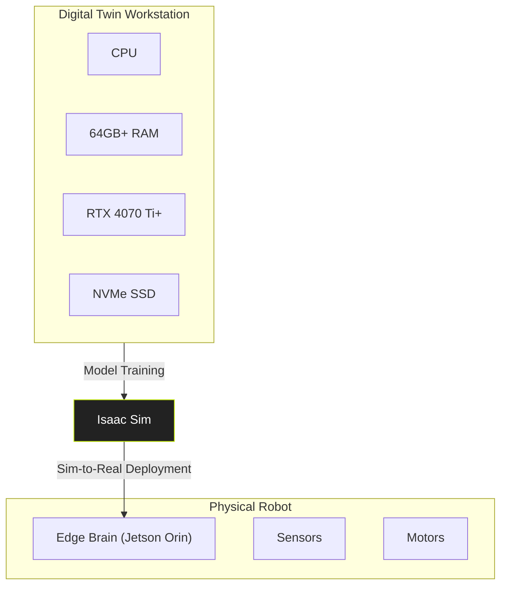

import HardwareCheck from '@site/src/components/HardwareCheck';
import TermTooltip from '@site/src/components/TermTooltip';

# 1.3 The Hardware Nervous System

Physical AI development operates on a specialized hardware stack that functions like a biological nervous system. It has a "brain" for heavy computation and a "spinal cord" for real-time reflexes. Unlike pure software development, where the primary constraint is processing speed, physical AI is fundamentally constrained by data throughput, latency, and power consumption. You cannot train these models on a standard laptop.

This chapter defines the two key hardware components that form the backbone of our development process: the **Digital Twin Workstation**, where we simulate reality and train our models, and the **Edge Brain**, which runs the trained model on the physical robot. Understanding the role of each is critical to building and deploying effective robotic systems.

:::warning Critical Prerequisite: NVIDIA RTX GPU
The simulation environment for this course, **NVIDIA Isaac Sim**, is a physically-accurate simulator that leverages ray tracing to generate realistic sensor data. This technology requires a modern NVIDIA RTX-class GPU. AMD and older NVIDIA GPUs (GTX series) are not supported.
:::

Use the interactive validator below to ensure your primary development machine meets the minimum requirements.

<HardwareCheck />

## The Digital Twin Workstation (The Simulation Rig)

The first half of our hardware nervous system is the **Digital Twin Workstation**. This is a powerful desktop PC, typically running Ubuntu 22.04, that serves as our virtual world. Here, we build, test, and train our AI in a perfect, repeatable, and safe simulation before deploying it to a physical robot. The primary function of this machine is to run **NVIDIA Isaac Sim**, a robotics simulator that creates photorealistic, physically accurate "digital twins" of robots and their environments.

The Workstation is where the heavy lifting happens. Training a <TermTooltip term="VLA">Vision-Language-Action (VLA)</TermTooltip> model involves processing massive datasets of images, physics states, and action commands. This requires immense parallel processing capability, which is why the GPU is the heart of this machine.

-   **Operating System**: Ubuntu 22.04 LTS
-   **Core Software**: NVIDIA Isaac Sim, Docker, VS Code
-   **Minimum GPU**: NVIDIA GeForce RTX 4070 Ti (12 GB)
-   **Recommended GPU**: NVIDIA GeForce RTX 4090 (24 GB)

### The VRAM Bottleneck Explained

Why the specific and demanding GPU requirement? The single most critical resource in simulation and AI training is **Video RAM (VRAM)**. It is the high-speed memory on the GPU where all the necessary data for rendering and computation is held. When this memory is exhausted, performance doesn't just slow down—it collapses. This is the VRAM Bottleneck.

In Isaac Sim, two main consumers compete for this limited resource:

1.  **USD Assets**: The 3D environment itself—the robot's components, the room, the objects to be manipulated—are all stored as <TermTooltip term="USD">Universal Scene Description (USD)</TermTooltip> assets. High-fidelity, photorealistic assets can consume several gigabytes of VRAM. A complex warehouse scene might require 8-10 GB alone, before the robot or the AI is even loaded.
2.  **AI Model Weights**: The neural network models, especially large VLA and perception models, have parameters or "weights" that must be loaded into VRAM for fast execution (inference). A moderately sized model can easily occupy 4-6 GB of VRAM.

**Example Scenario**:
-   A scene with a robot and a few objects: **6 GB**
-   A VLA model for planning: **5 GB**
-   The operating system and simulator overhead: **1 GB**
-   **Total Required VRAM: 12 GB**

This is why an RTX 4070 Ti with 12 GB of VRAM is the bare minimum. With anything less, the system must constantly swap data between the slow system RAM and the fast VRAM, a process called "paging," which causes simulation speed to plummet from real-time to a few frames per second, making training impossible. The 24 GB of VRAM on an RTX 4090 provides a comfortable buffer, allowing for more complex scenes and larger, more capable AI models.

## The Edge Brain (The Inference Unit)

The second half of the nervous system is the **Edge Brain**. This is a small, power-efficient, single-board computer that lives on the robot itself. Its job is to run the AI model that was trained on the Workstation. This process is called **inference**. The Edge Brain takes the pre-trained model and uses it to make real-time decisions based on live sensor data.

-   **Platform**: NVIDIA Jetson Series
-   **Minimum Model**: Jetson Orin Nano (8GB)
-   **Recommended Model**: Jetson AGX Orin (32GB)

The key difference between the Workstation and the Edge Brain is the distinction between **training** and **inference**. Training is a one-time, energy-intensive process done in simulation. Inference is a continuous, low-power process done on the physical hardware.

### "Sim-to-Real" Workflow

The entire development process is designed around a **"Sim-to-Real"** workflow. This is the process of transferring intelligence from the digital world to the physical world.

1.  **Simulate & Train (on Workstation)**: We develop and train our AI model entirely within Isaac Sim. We expose it to thousands of simulated scenarios, object positions, and lighting conditions—a process that would be impossibly slow and expensive to do with a physical robot. This is where the AI learns the desired skill (e.g., how to pick up a specific tool).
2.  **Deploy (to Edge Brain)**: Once the model performs well in simulation, its trained weights are saved. This file, often just a few gigabytes, is then transferred to the Jetson Orin on the robot.
3.  **Infer & Execute (on Robot)**: The Jetson loads the model into its own GPU memory. It then begins the inference loop:
    a. Capture live data from the robot's cameras and sensors.
    b. Feed this data into the AI model.
    c. The model outputs an action (e.g., "move arm to position X, Y, Z").
    d. The Jetson translates this action into low-level motor commands.
    e. Repeat, dozens of times per second.

This workflow allows us to do 99% of the development in a safe, fast, and cost-effective virtual environment. The expensive physical robot is only needed for the final validation and deployment step. The fidelity of Isaac Sim is so high that a model trained in the digital twin often works on the physical robot with minimal to no re-training, a concept known as **zero-shot sim-to-real transfer**.

## References
[1] M. `De-Arteaga`, et al. *Sim-to-Real Transfer for Bipedal Locomotion*, NVIDIA Technical Report, 2023.
[2] "Jetson Orin Nano Developer Kit," NVIDIA Developer. [Online]. Available: https://developer.nvidia.com/embedded/jetson-orin-nano-developer-kit.