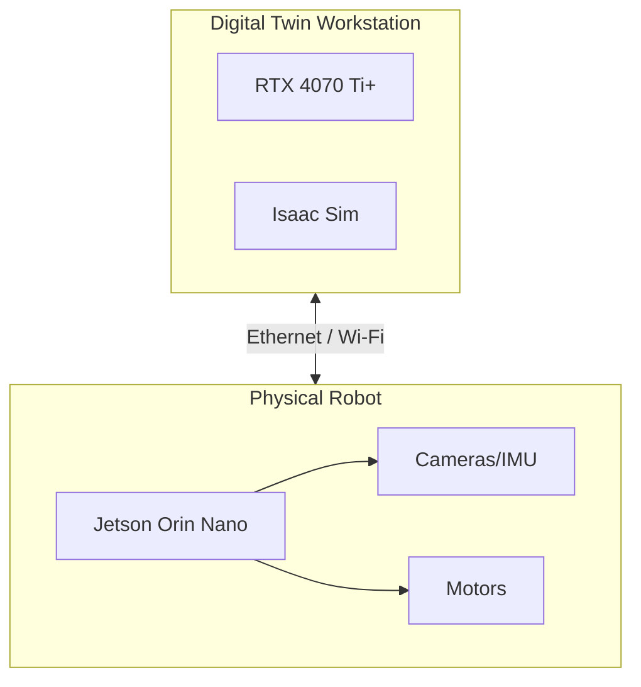

import HardwareCheck from '@site/src/components/HardwareCheck';

## 1.3 The Hardware Nervous System

Building Embodied Intelligence requires a specific class of hardware. You cannot train these models on a standard laptop. We treat the hardware as a **Nervous System**—a specialized network for processing sensory data and motor signals.

:::warning Critical Requirement
This course relies on **NVIDIA Isaac Sim**, which requires RTX-class GPUs with Ray Tracing capabilities.
:::

Use the interactive validator below to check if your current setup is ready for the course.

<HardwareCheck />

### Hardware Topology
The standard development setup involves two distinct computers working in tandem:

1.  **The Workstation (The Brain)**: A powerful PC running Ubuntu 22.04. This machine runs the "Digital Twin" simulations (Isaac Sim) and trains the AI models. It requires massive parallel processing power (CUDA).
2.  **The Edge Computer (The Spine)**: A small, power-efficient computer attached to the robot itself (e.g., NVIDIA Jetson). It handles real-time sensor processing and motor control during deployment.

