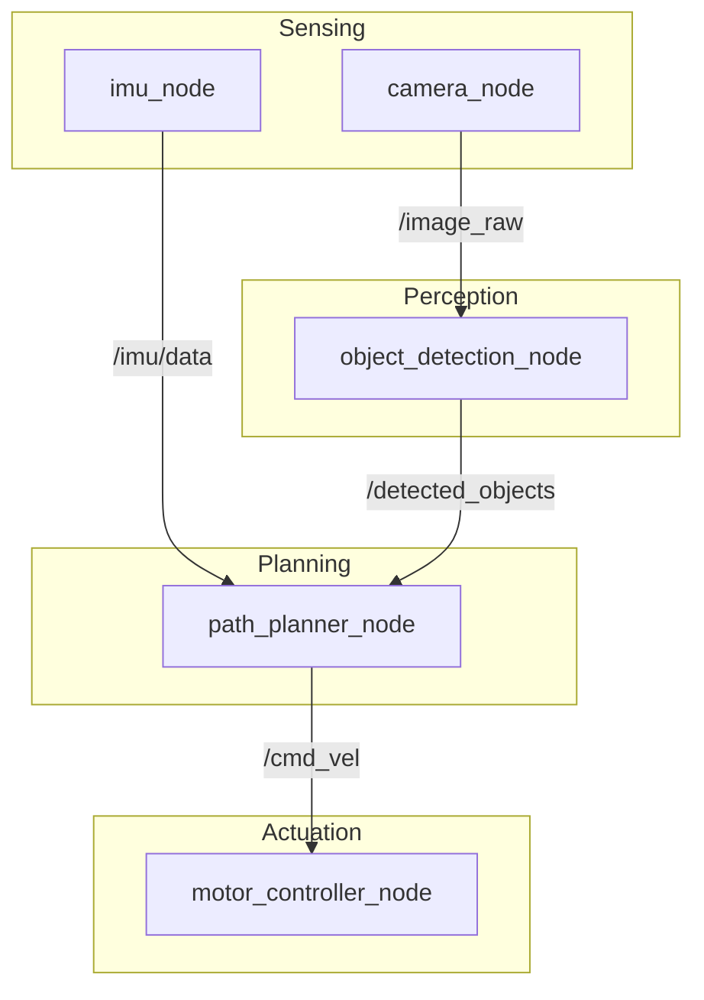

import ConceptCard from '@site/src/components/ConceptCard';

# 2.2 The Atomic Unit: Nodes & Graphs

ROS 2 applications are built from small, single-purpose programs called **nodes** [1]. A node is the "atomic unit" of ROS 2. Each node is responsible for a single task, such as controlling a wheel motor, reading a sensor, or planning a path. This modularity is a core design principle. Instead of one giant, monolithic program that does everything, a robot's intelligence is distributed across dozens of these small, independent nodes. This makes the system easier to debug, test, and reuse.

For example, a mobile robot might have the following nodes:
-   `camera_node`: Publishes raw image data from the robot's camera.
-   `lidar_node`: Publishes laser scan data.
-   `odometry_node`: Estimates the robot's position based on wheel encoder data.
-   `perception_node`: Subscribes to image data and publishes the location of detected objects.
-   `path_planner_node`: Subscribes to object locations and odometry, and publishes a path for the robot to follow.
-   `motor_controller_node`: Subscribes to the path and publishes low-level commands to the wheel motors.

## The Graph Concept

How do these isolated processes find each other and exchange information? They do it through the **ROS 2 Graph** [2]. The Graph is a network of all the ROS 2 nodes running on the system at a given time. Nodes are not hard-coded to know about each other. Instead, they use a discovery mechanism (based on the underlying DDS protocol) to find other nodes and the information they provide. This creates a flexible and dynamic system where nodes can be started, stopped, and replaced without reconfiguring the entire system.

The primary communication patterns in the ROS 2 Graph are:

### Topics (Publish/Subscribe)
For continuous, one-to-many streams of data. A node "publishes" data to a topic, and any number of other nodes can "subscribe" to that topic to receive the data. This is the most common communication pattern in ROS 2, used for things like sensor data, robot state, and control commands [3].

-   **Analogy**: A radio station (`/weather_reports` topic) broadcasting the weather. Anyone with a radio can tune in and listen. The broadcaster doesn't know who is listening, and the listeners don't know where the broadcast is coming from.
-   **Robotics Example**: A `camera_node` publishes images to the `/image_raw` topic. A `perception_node` subscribes to `/image_raw` to process the images, and a `recorder_node` might also subscribe to save the images to a file.

### Services (Request/Response)
For synchronous, one-to-one remote procedure calls. A "client" node sends a request to a "service" node and waits for a response. This is used for tasks that can be completed quickly, like querying the state of a sensor or triggering a specific, short-lived action.

-   **Analogy**: Making a phone call to ask a question and getting an answer. The conversation is direct, and you wait for the response before hanging up.
-   **Robotics Example**: A `path_planner_node` could be a client of a `reset_odometry` service. When the robot gets lost, the planner can call the service to reset the robot's position estimate to zero.

### Actions
For long-running, asynchronous tasks that provide feedback. An "action client" sends a goal to an "action server" (e.g., "rotate 360 degrees"). The server executes the goal, providing regular feedback (e.g., "rotated 90 degrees... 180 degrees...") and a final result. The client can also cancel the goal at any time.

-   **Analogy**: Ordering a pizza for delivery. You send a goal (the order), get feedback (order received, pizza in the oven, out for delivery), and a final result (pizza arrives). You can also call to cancel the order.
-   **Robotics Example**: An action could be used to command a robot arm to move to a specific joint configuration. The action server would execute the motion, providing feedback on the arm's current position along the way, and a final result indicating whether the goal was reached successfully.

<ConceptCard>
  

    
Think of it like a newspaper subscription. The camera node is the printing press, publishing a new edition (image) every day. The perception and planner nodes are subscribers who get the paper delivered to their door. They don't need to know where the printing press is; they just need the subscription.

  

  

    
Under the hood, ROS 2 topics are implemented using the Data Distribution Service (DDS) standard. This is a high-performance, real-time publish-subscribe messaging system that uses UDP multicast to efficiently send data to multiple subscribers on a network.

  

</ConceptCard>

This loose coupling between nodes is what makes ROS 2 so powerful and flexible. You can add, remove, or restart nodes without bringing down the entire system. The diagram below shows a simplified view of a typical robotics perception pipeline, illustrating how different nodes communicate via topics.

## References
[1] "ROS 2 Nodes," ROS 2 Documentation. [Online]. Available: https://docs.ros.org/en/humble/Tutorials/Beginner-CLI-Tools/Understanding-ROS2-Nodes/Understanding-ROS2-Nodes.html.
[2] T. Foote, "ROS 2 Graph," in *ROS 2 Design*, 2017. [Online]. Available: https://design.ros2.org/articles/ros_graph.html.
[3] "ROS 2 Topics," ROS 2 Documentation. [Online]. Available: https://docs.ros.org/en/humble/Tutorials/Beginner-CLI-Tools/Understanding-ROS2-Topics/Understanding-ROS2-Topics.html.
