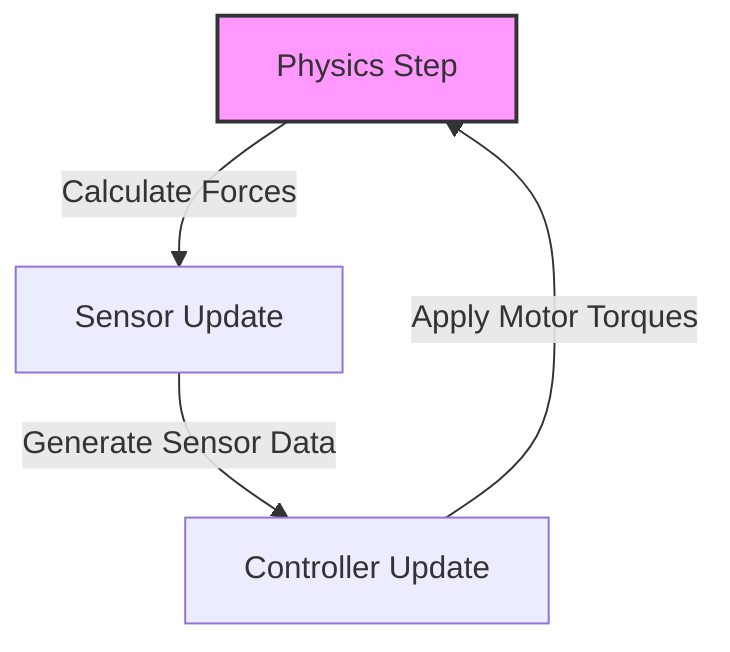

# 3.3 The Laws of Physics (Gazebo)

Defining the visual appearance of a robot is easy. Defining how it moves and interacts with the world is hard. This is the job of the **Physics Engine**. In the ROS 2 ecosystem, **Gazebo** is the default simulator. While it offers several physics backends (including Bullet, DART, and Simbody), the Open Dynamics Engine (ODE) has historically been the default.

Gazebo calculates **Rigid Body Dynamics**. It assumes objects are solid and undeformable. It solves complex systems of differential equations to determine the position and velocity of every link in the robot at every time step. To do this, it must solve constraints.

### Solving Constraints

Physics engines view the world as a giant optimization problem. At every time step, the solver must find a set of velocities and forces that satisfy all the laws of physics and all the constraints of the system.

-   **Joint Constraints**: A revolute joint (hinge) constrains the two connected links so they can only rotate around a single axis. They cannot pull apart or slide sideways.
-   **Contact Constraints**: When a wheel touches the ground, it creates a contact constraint. The wheel cannot penetrate the ground (non-penetration constraint), and friction resists sliding motion.
-   **Inertial Constraints**: Newton's laws (F=ma) dictate that an object resists acceleration based on its mass and inertia.

Solving this massive system of equations for a complex robot with dozens of joints and contact points is computationally expensive.

## The Simulation Loop

A simulator runs in a discrete loop. It doesn't calculate continuous time; it steps forward in small increments (dt), typically 1 millisecond (1000 Hz). In every step, the following happens:

1.  **Physics Step (The Solver)**: The physics engine takes the current state of the world and the forces applied (gravity, motor torques) and solves the constraint equations to determine the state of the world at time *t + dt*. This involves collision detection (finding who is touching whom) and constraint resolution (resolving forces). **This is entirely CPU-intensive.**
2.  **Sensor Update**: Once the objects have moved, the simulator renders the scene. It generates images for simulated cameras, point clouds for LIDARs, and data for IMUs. **This is largely GPU-intensive**, especially for high-fidelity rendering.
3.  **Controller Update**: The simulated robot's internal code (the ROS nodes) runs. They read the simulated sensor data, perform their logic (perception, planning), and output new motor commands (torques or velocities) for the next time step.

:::info Hardware Reality Check: CPU Bottleneck
While high-fidelity rendering requires a powerful GPU (like an RTX 4070 Ti), the **physics calculation is primarily a CPU task**. Simulating a complex robot with many joints and contacts (like a humanoid walking on uneven terrain) requires a CPU with extremely high single-core performance (like an Intel i7 or Ryzen 9). Physics engines are notoriously difficult to parallelize across many cores. If your CPU is too weak, the "Real Time Factor" will drop below 1.0, meaning the simulation runs slower than reality. This can wreak havoc on control loops that expect to run at a specific frequency.
:::

## References
[1] E. Coumans, "Bullet Physics Engine," 2015. [Online]. Available: https://pybullet.org/.
[2] "Gazebo Physics Engines," Gazebosim.org. [Online]. Available: https://gazebosim.org/api/physics/7.0/engines.html.
[3] S. Eerez et al., "Integrated simulation and control of a 6-DOF robot arm," in *IEEE International Conference on Robotics and Automation*, 2011.